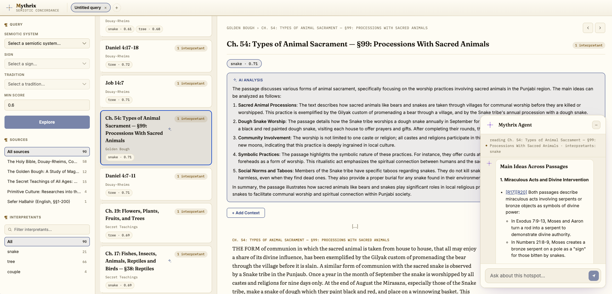

# Mythrix Engine

> 🚧 **Work in Progress** — Mythrix is an actively developed project. The architecture, APIs, data model, and user experience are still evolving.

**An explainable symbolic-interpretation engine where every retrieved result is grounded in cited primary sources — never presented as an unsupported model guess.**

Symbol-interpretation systems typically face a trade-off between explainability and flexibility. Traditional systems can provide explicit sources but are often limited to predefined interpretations, while LLM-based systems can produce fluent explanations without a verifiable reasoning trail.

Mythrix takes a different approach. It combines a domain-agnostic Sign Graph with an independent document corpus and a deterministic retrieval and ranking pipeline. The symbolic system defines the concepts associated with a sign; those concepts are then used to retrieve evidence from a separate corpus, and passages where multiple concepts converge are ranked as candidate interpretive hotspots. The LLM does not decide what a result is or generate the underlying evidence. It only orchestrates read-only tools and composes retrieved, cited evidence into a conversational response.

Everything runs locally — no hosted API dependency and no data leaving your machine.

## The core idea

Mythrix separates symbolic knowledge from textual evidence.

A symbolic system defines a sign and its interpretants. Those interpretants are then used as retrieval queries against an independent document corpus. The system does not search for a pre-written interpretation of the sign. Instead, it looks for passages where multiple independent concepts associated with the sign converge, and ranks those passages according to the specificity and strength of their matches.

This separation makes the retrieval pipeline reusable across symbolic domains and document corpora. The same engine can operate on a different symbolic system or a different collection of source documents without changing the underlying retrieval and ranking architecture.

## What it does

Query a symbol — for example, the Tower card in the Rider-Waite tradition — and Mythrix returns ranked, cited evidence rather than a generated paragraph of symbolic meaning. The system combines structured symbolic knowledge with independent textual sources and exposes the retrieval process all the way from the original sign to the passages that support the resulting convergence.

- **Graph facts** — the sign's properties, interpretants, and cross-domain correspondences, such as the Tower's Hebrew-letter correspondence through a Golden Dawn attribution, retrieved from the structured Sign Graph.

- **Concept and concept-pair retrieval** — each of the sign's interpretants (`"fire"`, `"falling figures"`, `"lightning"`, ...) independently retrieves matching passages from an unrelated reference corpus such as the Douay-Rheims Bible or Sefer HaBahir. Passages matched by multiple interpretants are grouped as convergence hotspots.

- **Ranked convergence hotspots** — contiguous passages are scored using a specificity-weighted convergence formula. Rarer surface forms contribute more weight than common terms, so a passage matched by several distinct concepts can outrank one matched by a single common word. Every result includes the verbatim source text and an exact citation rather than only a document locator.

- **A grounded chat agent** — a docked conversational panel allows a local model to answer questions about retrieved results by calling the same read-only tools exposed by the API: symbol lookup, region query, segment fetch, and summarization. The agent is constrained to the evidence returned by those tools.

The reference dataset demonstrates the domain-agnostic design: it includes all 22 Tarot Major Arcana, all 22 Hebrew letters with Sepher Yetzirah correspondences, and cross-links between the two symbolic systems. Both are retrieved against an independent corpus of Biblical and Kabbalistic texts, demonstrating that the retrieval pipeline operates on the structure of the symbolic system and the declared document corpus rather than on tarot-specific logic.

## See it in action



A query against a symbol produces ranked convergence hotspots with verbatim source passages and exact citations. The conversational agent can then inspect the same result through read-only tools, with its tool trace visible for every turn.

## Architecture

Mythrix is structured around a deterministic core library that is shared by the CLI, HTTP API, and web application. The conversational agent sits at the boundary of this system and interacts with the same core capabilities through a fixed set of read-only tools.

The resulting architecture keeps the retrieval and ranking path deterministic while allowing an LLM to provide a flexible conversational interface over the resulting evidence.

```
┌──────────-───┐     ┌──────────────────────────┐     ┌────────────────────┐
│ CLI (Typer)  │     │  Backend API (FastAPI)   │     │ Web viewer (React) │
└──────┬───────┘     └────────────┬─────────────┘     └─────────┬──────────┘
       │                          │                             │
       └───────────-───┬──────────┴─────────────────────────────┘
                       │
              ┌────────▼──────────--┐
              │   Core library      │   deterministic retrieval & ranking —
              │  (retrieval, graph, │   no model in the decision path
              │  synthesis, loaders)│
              └────────┬─────────--─┘
                       │
         ┌─────────────┼────────────--──┐
         │                              │
   ┌─────▼───-───┐              ┌───────▼────────┐
   │ Kuzu graph  │              │ Chroma vector  │
   │(Sign Graph) │              │ store (corpus) │
   └──────────-──┘              └────────────────┘

              ┌────────────────────────────┐
              │  Conversational agent      │  local Ollama model,
              │  (tool-calling loop)       │  read-only tools only,
              │  served by the backend API │  citation-validated
              └────────────────────────────┘
```

- **Sign Graph** ([Kuzu](https://kuzudb.com)) — a domain-agnostic knowledge graph representing signs, traditions, tradition-scoped manifestations, interpretants, and typed, attributable cross-domain correspondences. The schema contains no fields specific to tarot, religion, or any other symbolic domain; this constraint is enforced by an automated lint check rather than by convention.
- **Document corpus** ([Chroma](https://www.trychroma.com)) — source documents segmented along their *own* declared structure (verse, numbered section) rather than fixed-size windows, so a citation always resolves to a real structural unit.
- **Retrieval** — two complementary matching channels, dense embedding similarity and exact-token containment, are evaluated live for each interpretant at query time. There is no precomputed match matrix: changing the Sign Graph immediately changes the retrieval results on the next query.
- **Ranking** — candidate regions are scored using a from-scratch lexical-IDF scheme that combines convergence across multiple concepts with lexical specificity. The algorithm deliberately does not use BM25; the rationale is documented in [ADR-002](specs/architecture-decisions/adr-002-dense-plus-exact-token-no-bm25.md) and [ADR-004](specs/architecture-decisions/adr-004-absolute-floor-and-lexical-specificity-ranking.md).
- **Agent** — a bounded tool-calling loop over a fixed, read-only tool set. The agent can inspect and summarize retrieved evidence, but it cannot modify the Sign Graph or document corpus, bypass the retrieval pipeline, or introduce unsupported facts into the result. This keeps deterministic retrieval separate from probabilistic language generation ([ADR-006](specs/architecture-decisions/adr-006-conversational-agent-orchestration-boundary.md)).

Full rationale for every non-obvious call — why no BM25, why live matching over precomputation, why Chroma over a hosted vector DB — is written up in [`specs/architecture-decisions/`](specs/architecture-decisions/).

## Tech stack

| Layer | Tech |
|---|---|
| Core / retrieval | Python 3.12, LangChain, LangGraph |
| Graph store | Kuzu |
| Vector store | Chroma |
| Local LLM runtime | Ollama (embedding + generation, fully offline) |
| API | FastAPI |
| CLI | Typer |
| Frontend | React 19, TypeScript, Vite |
| Testing | pytest, Vitest + React Testing Library |

## Try it

```bash
cd api && uv sync
# install Ollama, pull nomic-embed-text — see docs/SETUP.md for the full walkthrough
cd ..

uv run --project api mythrix load-signs data --json
uv run --project api mythrix load-documents data/corpus/scripture/en_drb/douay-rheims-bible.txt \
  --tradition douay-rheims --source-slug douay-rheims-bible --json

uv run --project api mythrix query --sign the-tower --tradition rider-waite
```

Full setup — Ollama models, configuration, and running the API + web viewer together — is in [`docs/SETUP.md`](docs/SETUP.md).

## Docs

The full functional spec is in [`specs/spec.md`](specs/spec.md); the reasoning behind the non-obvious architectural calls is recorded as [ADRs](specs/architecture-decisions/).

## License

AGPL-3.0-or-later — see [LICENSE](LICENSE).
