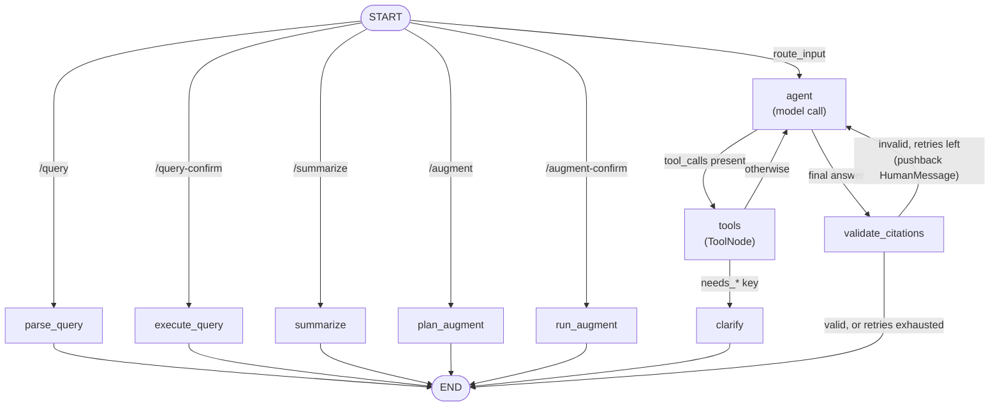

# The Agent Graph

This document is a reference for the LangGraph state machine one conversational
turn runs through: every node and edge, the tool-calling loop, the citation
retry loop, and the full `/` command vocabulary. It complements
[architecture.md §5](architecture.md#5-the-conversational-agent), which gives
the narrative version — this one is the diagram and the tables. The graph
itself is built by
[`agent/graph/builder.py::compile_agent_graph`](../api/src/mythrix/agent/graph/builder.py),
which stays the source of truth if this document and the code ever disagree.

## Contents

- [1. Graph diagram](#1-graph-diagram)
- [2. Nodes](#2-nodes)
- [3. Command dispatch](#3-command-dispatch)
- [4. The tool-calling loop](#4-the-tool-calling-loop)
- [5. Citation validation and retry](#5-citation-validation-and-retry)
- [6. Bounds and the recursion budget](#6-bounds-and-the-recursion-budget)
- [7. Turn state](#7-turn-state)
- [8. Related specs and ADRs](#8-related-specs-and-adrs)

## 1. Graph diagram

Two loops share the graph: the **tool-calling loop** (`agent` ⇄ `tools`) and
the **citation-retry loop** (`agent` → `validate_citations` → `agent`). Both
count toward the same outer `recursion_limit` (§6) — there is one budget, not
two independent ones.

## 2. Nodes

| Node | Kind | Purpose | Source |
|---|---|---|---|
| `agent` | model call | Prepends the system prompt (+ `context_summary`) fresh every call, invokes the tool-bound model. | [`graph/nodes/llm.py::agent_node`](../api/src/mythrix/agent/graph/nodes/llm.py) |
| `tools` | deterministic | A `ToolNode` over `toolset.model_tools`, the fixed read-only tool set. | `langgraph.prebuilt.ToolNode` |
| `clarify` | deterministic | Builds a clarifying question straight from a tool result's `needs_*` payload — no model call. | [`graph/nodes/llm.py::clarify_node`](../api/src/mythrix/agent/graph/nodes/llm.py) |
| `validate_citations` | deterministic | Checks the reply's `[G#]`/`[S#]`/`[C#]` markers against this turn's tool results; pushes back, falls back, or lets it through. | [`graph/nodes/citation_check.py::validate_citations_node`](../api/src/mythrix/agent/graph/nodes/citation_check.py) |
| `parse_query` | deterministic | Parses an ad-hoc query into a pending confirmation. | [`graph/nodes/adhoc.py::parse_query_node`](../api/src/mythrix/agent/graph/nodes/adhoc.py) |
| `execute_query` | deterministic | Runs a previously parsed and confirmed ad-hoc query. | [`graph/nodes/adhoc.py::execute_query_node`](../api/src/mythrix/agent/graph/nodes/adhoc.py) |
| `summarize` | deterministic + 1 generative step | Fetches the active hotspot's passage, then summarizes it. | [`graph/nodes/summary.py::summarize_node`](../api/src/mythrix/agent/graph/nodes/summary.py) |
| `plan_augment` | deterministic | Plans a `/augment` run over the viewer's visible regions, returns a pending confirmation. | [`graph/nodes/augment.py::plan_augment_node`](../api/src/mythrix/agent/graph/nodes/augment.py) |
| `run_augment` | deterministic + many generative steps | Executes a confirmed `/augment` run: read → augment → hierarchical consolidation. | [`graph/nodes/augment.py::run_augment_node`](../api/src/mythrix/agent/graph/nodes/augment.py) |

Every deterministic node reaches `END` directly — none of the five command
nodes route through `agent` or `tools`; the orchestration model never sees a
command's own execution.

## 3. Command dispatch

`route_input` ([`graph/builder.py`](../api/src/mythrix/agent/graph/builder.py))
is the **only** place command dispatch happens, and it is a pure lookup — the
declared vocabulary itself lives in
[`agent/capabilities.py`](../api/src/mythrix/agent/capabilities.py)
(`AGENT_CAPABILITIES`), which `GET /api/agent/capabilities` serves to the
viewer so the frontend's command list can't drift from the backend's. This
table is that registry:

| Command | Args | Handled by | Listed | Summary |
|---|---|---|---|---|
| `/clear` | — | client | yes | Clear this thread and start a new session — no backend node exists for this one. |
| `/summarize` | — | server | yes | Summarize the passage selected in the viewer. |
| `/query` | `term[:exact\|:filter], …` | server | yes | Search the corpus on your own terms, with no sign selected. |
| `/query-confirm` | `<id>` | server | no | Run a parsed ad-hoc query. |
| `/augment` | `<what to look for>` | server | yes | Read every region on screen against a question and consolidate what recurs. |
| `/augment-confirm` | `<id>` | server | no | Run a parsed augmentation. |

Everything not matching one of the five server-handled commands above falls
through to `agent` — the ordinary conversational path.

`/query-confirm` and `/augment-confirm` are **not listed** (`listed: false`):
they exist for the viewer's own confirm affordance to invoke, not for a user
to type from memory. The pending confirmation each command produces is
round-tripped through the session via `PendingCommands`
(`agent/commands/__init__.py`) rather than held in graph state, since the
graph carries no state between turns.

## 4. The tool-calling loop

`agent` invokes the model with the fixed read-only tool set bound
(`toolset.model_tools`); a reply carrying tool calls routes to `tools`
(`route_after_agent`), which executes them and routes back to `agent`
(`route_after_tools`) — repeating until a reply carries no tool calls.

One interception sits in that loop: if a tool result is a JSON payload
carrying a truthy `needs_*` key (today, only `get_sign`'s `needs_tradition`),
`route_after_tools` sends it to `clarify` instead of back to `agent`.
`clarify_node` composes the clarifying question directly from the tool
payload's own candidate list — no model call — so the question can never
state anything the tool didn't actually return
([ADR-006](../specs/architecture-decisions/adr-006-conversational-agent-orchestration-boundary.md)).
`clarify` goes straight to `END`.

## 5. Citation validation and retry

Every reply with no further tool calls is checked before it can end the
turn — `route_after_agent` sends it to `validate_citations`, never straight
to `END`.

`validate_citations_node` finds this turn's own tool results via
`turn_start_index` (fixed once per turn, so a prior retry's own pushback
message can't be mistaken for the turn boundary), then checks the reply's
`[G#]`/`[S#]` markers — the opaque, tool-issued grounding ids
([ADR-022](../specs/architecture-decisions/adr-022-tool-owned-opaque-grounding-ids.md))
— against that set:

- **Valid**, or only listing tools were called (nothing to cite): no-op, the
  reply stands, the graph proceeds to `END`.
- **Invalid, retries remaining**: a corrective `HumanMessage`
  (`prompts.py::render_citation_pushback` /
  `render_missing_citation_pushback`) naming exactly what was wrong is
  appended, and the graph routes back to `agent` for another attempt.
- **Invalid, retries exhausted**: the reply is replaced with the fixed
  `CITATION_FAILURE_MESSAGE` and the graph proceeds to `END`.

This replaced a one-shot post-hoc reject that discarded the entire reply on
any invalid marker with no chance to correct it
([ADR-023](../specs/architecture-decisions/adr-023-in-graph-citation-retry.md)).
Real-model testing found the model rarely fabricates a grounding id but
often *formats* a real one wrong — a recoverable mistake a bounded retry can
fix, rather than one that needs the whole answer thrown away.

## 6. Bounds and the recursion budget

| Setting | Env var | Default | Governs |
|---|---|---|---|
| `agent_max_tool_iterations` | `MYTHRIX_AGENT_MAX_TOOL_ITERATIONS` | `16` | The graph's `recursion_limit` for one turn (`runner.py::stream_turn`) — every step through `agent`, `tools`, and `validate_citations` counts against it, not just tool calls. |
| `citation_max_retries` | `MYTHRIX_CITATION_MAX_RETRIES` | `2` | How many times `validate_citations_node` may push back before falling back to `CITATION_FAILURE_MESSAGE`. |
| `augment_max_regions` | `MYTHRIX_AUGMENT_MAX_REGIONS` | `1000` | How many visible regions one `/augment` run reads. Does not consume `agent_max_tool_iterations` — `run_augment` is a deterministic node the model's tool loop never enters. |
| `augment_consolidation_group_size` | `MYTHRIX_AUGMENT_CONSOLIDATION_GROUP_SIZE` | `8` (min `2`) | How many results one hierarchical-consolidation call may be given, at every level of `/augment`'s reduce (§4.2 in architecture.md). |

`agent_max_tool_iterations` and `citation_max_retries` are independent
budgets that both draw on the **same** `recursion_limit`: a full
citation-retry cycle costs two graph steps (the agent's reattempt, then the
citation check), so exhausting the default `citation_max_retries` alone can
cost up to `2 * (citation_max_retries + 1)` steps before a single tool call
is even counted. `agent_max_tool_iterations`'s default is sized with that
overhead in mind. Hitting the limit ends the turn with a fixed message
(`runner.py`'s `_RECURSION_LIMIT_MESSAGE`) and discards the runaway turn's
messages — `TurnResult.history` is the history that was passed in.

## 7. Turn state

`AgentState` ([`graph/state.py`](../api/src/mythrix/agent/graph/state.py)):

| Field | Type | Notes |
|---|---|---|
| `messages` | `list` (`add_messages`) | The conversation, including this turn's pushback/tool messages. |
| `context_summary` | `str` | Folded into the system prompt by `agent_node`. |
| `pending_query` | `PendingAdhocQuery \| None` | Round-tripped through `PendingCommands`; the graph holds no state across turns. |
| `pending_augmentation` | `PendingAugmentation \| None` | Same, for `/augment`. |
| `instructions` | `list[dict]` | Instructions emitted for the viewer (e.g. `execute_query`, `augment_region`). |
| `region_id`, `interpretant`, `visible_regions` | turn-scoped inputs | The session's active hotspot and the consumer's current display; read by the deterministic nodes, never read back off final state. |
| `backend_authored` | `bool` | Marks a reply with no model-authored text, so `turn_service.py` can distinguish an ungrounded citation from a marker sequence the backend itself put there. |
| `turn_start_index` | `int` | Index into `messages` where this turn began; lets `validate_citations_node` find this turn's tool messages across zero or more retries. |
| `citation_retry_count` | `int` | This turn's citation-pushback count so far, compared against `citation_max_retries`. |

## 8. Related specs and ADRs

- [`specs/interfaces/agent.md`](../specs/interfaces/agent.md) — the conversational agent's functional requirements.
- [`specs/interfaces/agent-capabilities.md`](../specs/interfaces/agent-capabilities.md) — the declared command/instruction vocabulary.
- [`specs/interfaces/agnostic-query.md`](../specs/interfaces/agnostic-query.md), [`specs/interfaces/augmentation.md`](../specs/interfaces/augmentation.md) — the two multi-step command flows.
- [ADR-006](../specs/architecture-decisions/adr-006-conversational-agent-orchestration-boundary.md) — orchestrate-not-retrieve boundary.
- [ADR-011](../specs/architecture-decisions/adr-011-backend-declared-agent-capabilities.md) — backend-declared capabilities.
- [ADR-012](../specs/architecture-decisions/adr-012-deterministic-command-nodes-bypass-tool-selection.md) — deterministic command nodes.
- [ADR-015](../specs/architecture-decisions/adr-015-deterministic-augmentation-over-viewer-regions.md), [ADR-016](../specs/architecture-decisions/adr-016-hierarchical-map-reduce-augmentation-consolidation.md) — `/augment`'s deterministic pipeline and consolidation shape.
- [ADR-022](../specs/architecture-decisions/adr-022-tool-owned-opaque-grounding-ids.md) — grounding id format.
- [ADR-023](../specs/architecture-decisions/adr-023-in-graph-citation-retry.md) — the citation retry loop this document diagrams.
