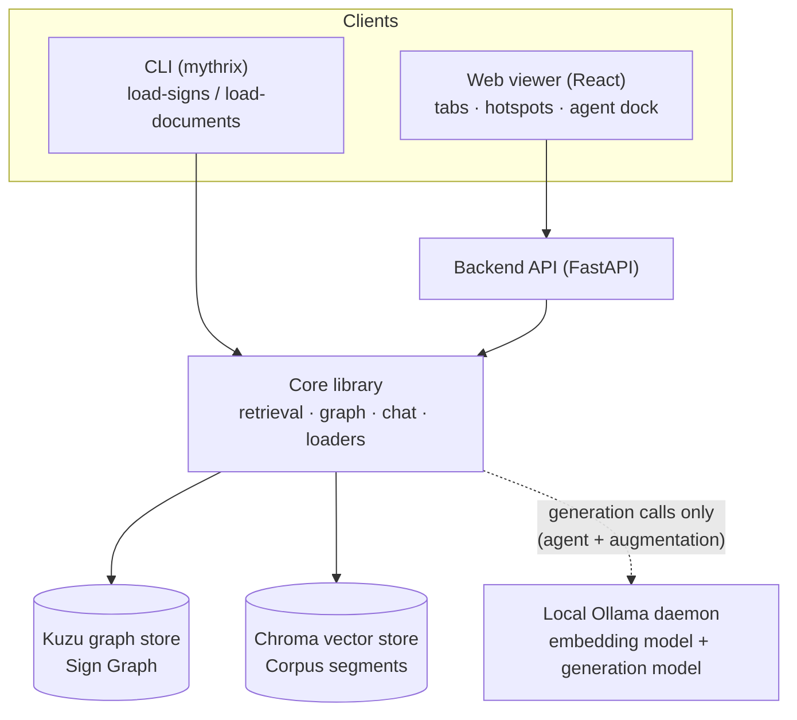
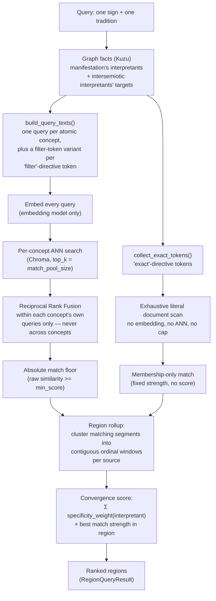
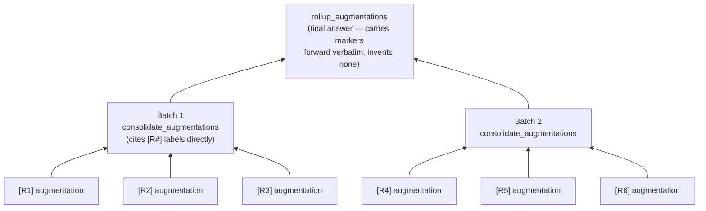

# Architecture

This document explains how Mythrix is built and why, for someone reading the
code for the first time. It is a companion to the formal specs under
[`specs/`](../specs/spec.md) — those are the source of truth for requirements
(`FR-*` identifiers) and decisions (`ADR-*`); this document is prose and
diagrams that connect them to the actual modules in `api/src/mythrix/`.

## Contents

- [1. System overview](#1-system-overview)
- [2. The two stores: Sign Graph and Corpus](#2-the-two-stores-sign-graph-and-corpus)
- [3. The retrieval pipeline](#3-the-retrieval-pipeline)
- [4. Region augmentation (`/augment`)](#4-region-augmentation-augment)
- [5. The conversational agent](#5-the-conversational-agent)
- [6. The web viewer](#6-the-web-viewer)
- [7. Backend API surface](#7-backend-api-surface)
- [8. Configuration](#8-configuration)
- [9. Further reading](#9-further-reading)

## 1. System overview

Mythrix retrieves and ranks evidence for symbolic queries (e.g. "what does
The Tower mean in the Rider-Waite tradition?") entirely through code —
graph lookups, vector search, and lexical matching. A local LLM only ever
composes or paraphrases *already-retrieved* evidence; it never decides what a
result *is*. This split is the central architectural invariant of the whole
codebase ([ADR-006](../specs/architecture-decisions/adr-006-conversational-agent-orchestration-boundary.md)).



One core library (`mythrix.core`) sits behind every surface: the CLI's data
loaders, the FastAPI backend's query and agent routes, and — transitively —
the React web viewer. No retrieval or ranking logic is duplicated anywhere
above that layer.

Everything runs against a **local Ollama daemon** — there is no hosted/cloud
model dependency. Two model roles are kept strictly separate:

| Role | Used by | Used for |
|---|---|---|
| **Embedding model** (`nomic-embed-text` by default) | Document ingestion + query-time retrieval | Turning text into vectors for similarity search. Never makes a decision. |
| **Generation model** (no default — set via `MYTHRIX_GENERATION_MODEL`) | Agent chat turns, `/summarize`, `/augment` | Composing natural-language text from retrieved evidence. Never runs on the query path. |

## 2. The two stores: Sign Graph and Corpus

- **Sign Graph** ([Kuzu](https://kuzudb.com), `core/graph/`) — a
  domain-agnostic graph of `sign`, `tradition`, `manifestation` (a sign
  within one tradition), `interpretant` (a meaning token — the source of all
  retrieval query text), and `intersemiotic_interpretant` (a typed edge to
  another sign's interpretants). Curator-authored YAML under
  `data/semiotic_systems/` is loaded here by `mythrix load-signs`.
- **Corpus** ([Chroma](https://www.trychroma.com), `core/vector/`) — primary
  source documents segmented along their *own* declared structure (verse,
  numbered section — never a fixed-size window), so a citation always
  resolves to a real structural unit. Loaded by `mythrix load-documents`.
  The corpus is deliberately **not** the text a sign's facts were extracted
  from — it's an independent body of source material the graph's symbolism
  is read *through* ([corpus.md](../specs/retrieval/corpus.md) FR-CO-02).

A query never touches the corpus directly with user text. It always goes
graph → interpretants → query text → corpus.

## 3. The retrieval pipeline

Implemented in
[`core/retrieval/pipeline.py`](../api/src/mythrix/core/retrieval/pipeline.py)
(`RetrievalPipeline.retrieve_regions`). Given a sign and tradition, this is
the deterministic, code-only path from graph facts to a ranked list of
regions.



Key mechanics, each grounded in a spec requirement:

- **Live, per-interpretant matching, no precompute.** Every interpretant is
  matched at query time; adding or editing one changes results on the very
  next query with no rebuild step
  ([retrieval.md](../specs/retrieval/retrieval.md) FR-RT-12,
  [ADR-003](../specs/architecture-decisions/adr-003-live-per-interpretant-matching-no-precompute.md)).
- **Three matching channels per interpretant**, selected by a curator-set
  `query.directive`:
  - `"concept"` (default) — dense embedding similarity, must clear an
    **absolute** match floor (never a rank cutoff, never normalized across a
    query's own results) — FR-RT-13/14.
  - `"filter"` — a literal-text containment check (`query.as_token`),
    applied *alongside* every concept's plain query, globally across every
    concept reachable from the sign — FR-RT-15.
  - `"exact"` — an exhaustive literal scan of the whole corpus, never
    embedded, never rank-capped — every occurrence surfaces — FR-RT-17/18.
  - `"skip"` — excluded from retrieval entirely, remains an ordinary graph
    fact — FR-RT-11.
- **Reciprocal Rank Fusion (RRF)** merges a concept's several query variants
  (plain + each filter-token pairing) by *rank*, not raw similarity score —
  so results aren't skewed by one query variant's score distribution being
  different from another's
  ([ADR-007](../specs/architecture-decisions/adr-007-rrf-fusion-and-geometric-mean-pair-scoring.md)).
  Fusion happens **within one concept's own queries only** — never pooled
  across different concepts.
- **Region rollup is the sole result shape** (no more separate per-concept /
  concept-pair result groups —
  [ADR-013](../specs/architecture-decisions/adr-013-region-rollup-sole-query-shape.md)).
  Matches are clustered into contiguous spans of one source's segments
  (`region_window_size`, default 3); within a region, an interpretant keeps
  only its single best match, so a repeated token can't inflate a score by
  repetition alone.
- **Specificity-weighted convergence score** — no BM25, no rank fusion
  across interpretants
  ([ADR-002](../specs/architecture-decisions/adr-002-dense-plus-exact-token-no-bm25.md)).
  Instead, a from-scratch lexical-IDF-style weight —
  `log(corpus_size / document_frequency(surface_form))` — makes a rare
  surface form worth more than a ubiquitous one
  ([ADR-004](../specs/architecture-decisions/adr-004-absolute-floor-and-lexical-specificity-ranking.md)).
  A region's score is the sum, over its matching interpretants, of
  `weight × match_strength`. Convergence (more distinct interpretants
  matching) raises rank as an emergent property of that sum — it is a
  ranking signal, not an eligibility gate (`region_min_interpretants`
  defaults to 1: even an isolated match is rankable).

The output (`RegionQueryResult`) carries every constituent segment's verbatim
text, structural locator, and per-interpretant attribution — enough for a
result to be reproduced and audited later even if the corpus or models
change ([retrieval.md](../specs/retrieval/retrieval.md) FR-RT-06).

## 4. Region augmentation (`/augment`)

Augmentation answers a free-text question **across every region the viewer
is currently showing** — it retrieves nothing new; it reads exactly what's
on screen. It's a chat command, layered on the agent's turn handler
([agent/commands/augment.py](../api/src/mythrix/agent/commands/augment.py),
[agent/graph/nodes/augment.py](../api/src/mythrix/agent/graph/nodes/augment.py)),
but its dispatch is entirely deterministic code — the orchestration model
never chooses which operations run
([ADR-015](../specs/architecture-decisions/adr-015-deterministic-augmentation-over-viewer-regions.md)).

### 4.1 Plan → confirm → run

```mermaid
sequenceDiagram
    participant U as User
    participant T as Turn handler (code)
    participant LLM as Generation model

    U->>T: /augment <free-text focus>
    Note over T: plan_augment_node<br/>snapshots focus + visible region ids<br/>invokes no model, reads nothing
    T-->>U: "Focus: …. Reads N regions,<br/>1 call each + C to consolidate.<br/>Send /augment-confirm &lt;id&gt;"

    U->>T: /augment-confirm <id>
    loop for each region, in supplied order
        T->>T: read_region(region_id) — verbatim passage
        T->>LLM: augment_passage(passage, focus)
        LLM-->>T: one region's reading
        T-->>U: stream: "Augmented [R#] …" + augment_region instruction
    end
    T->>T: hierarchical map-reduce consolidation (§4.2)
    T-->>U: terminal reply = consolidation + count
```

- `/augment` never runs anything — it only parses the focus and snapshots
  the region list the confirm step will act on, so a slow-arriving
  confirmation still augments the list the user actually saw
  ([augmentation.md](../specs/interfaces/augmentation.md) FR-AU-05, FR-AU-09).
- The region list, order, and truncation are exactly what the viewer sent —
  no model selects, drops, or reorders a region (FR-AU-13).
- Each region produces **exactly one** generation call, given only its own
  verbatim passage, source, locator, and the focus — instructed to answer
  from the passage alone (FR-AU-19).
- Every region gets a citation marker `[R1]`, `[R2]`, … by its position in
  the *supplied* list, so a region that couldn't be read leaves a gap rather
  than shifting the numbers after it (FR-AU-16, FR-AU-30).
- Results stream to the consumer region-by-region as they land, each tagged
  to the region it belongs to — a long run stays legible while running
  (FR-AU-23).

### 4.2 Hierarchical map-reduce consolidation

A single "read everything and summarize in one call" step degrades in
quality as the region count grows (empirically: fine around 20 regions, bad
by 50 — see
[ADR-016](../specs/architecture-decisions/adr-016-hierarchical-map-reduce-augmentation-consolidation.md)).
Instead, augmentations are consolidated in **bounded batches**, and batch
results are consolidated again if more than one batch's worth remain —
repeating until exactly one result is left. This is the "hierarchical
MapReduce" referenced throughout the specs: each level is a *map* (one
generation call per batch) followed, once all batches at that level finish,
by treating their outputs as the input to the next *reduce* level.



The mechanics that make this safe:

- **Two distinct tools, not one overloaded.** `consolidate_augmentations`
  runs only at the leaf level, over raw `[R#]`-labeled augmentation texts —
  its prompt's citation vocabulary is exactly those labels.
  `rollup_augmentations` runs at every level above, over already-synthesized
  text that *already contains* `[R#]` markers from below — its one
  instruction is to carry every marker forward unchanged and invent none.
  Overloading a single prompt for both shapes was rejected: a summary has no
  single label to cite from, and asking a model to both drop and reinvent
  markers in the same call is fragile.
- **A marker is assigned exactly once**, at the leaf level, and never
  reassigned by anything above it. The final terminal reply is validated
  against that same leaf-level region record regardless of how many
  consolidation levels produced the text (FR-AU-31, FR-AU-39).
- **The invocation count is arithmetic, not model-driven.** For `N`
  augmentations and a configured batch size, the total model calls are
  `N + C(N, batch_size)`, computed in code before the run starts
  (`consolidation_call_bound` in
  [`agent/commands/augment.py`](../api/src/mythrix/agent/commands/augment.py))
  — collapsing to the original `N + 1` when `N` fits in one batch. The plan
  shown to the user states this exact number, never "up to."
- Progress for the reduce phase streams too: every non-final consolidation
  call reports a "Consolidated group X/Y (pass Z)" message before the run
  continues (FR-AU-41).

### 4.3 Grounding invariant

Every claim in the final answer traces to a region that was actually
augmented this run. A `[R#]` marker naming any other region fails turn
validation, exactly like the graph-fact and segment markers the agent
already validates elsewhere ([agent.md](../specs/interfaces/agent.md)
FR-AG-06). Markers a model emits *inside* one region's own augmentation are
stripped before delivery — an augmentation carries no citation vocabulary of
its own (FR-AU-31).

## 5. The conversational agent

`agent/graph/` builds a bounded LangGraph tool-calling loop
(`agent/graph/builder.py`) over a fixed, read-only tool set
(`agent/tools/`): list systems/signs/traditions, get one sign's facts, run a
region query, fetch a verbatim segment range, and summarize a passage. None
of these tools write to either store — read-only is a structural property of
the registered set, not a runtime check (FR-AG-04).

The orchestration model chooses *which* of those tools to call and composes
the reply, but it never decides what a graph fact or a retrieved segment
*is* — that boundary is the same one retrieval enforces
([ADR-006](../specs/architecture-decisions/adr-006-conversational-agent-orchestration-boundary.md)).
Three command pairs bypass the model's own tool selection entirely and run a
fixed, code-decided sequence instead, reached directly from `route_input` as
dedicated LangGraph nodes the model never enters:

- `/query`/`/query-confirm` — an ad-hoc, sign-free interpretant search
  ([agnostic-query.md](../specs/interfaces/agnostic-query.md),
  [ADR-010](../specs/architecture-decisions/adr-010-agnostic-adhoc-interpretant-query.md)).
  This was the original case: a false-positive execution is the one failure
  the confirmation gate exists to prevent, so the model isn't trusted even
  to orchestrate it.
- `/summarize` — fetch the active hotspot's passage, then summarize it
  ([ADR-012](../specs/architecture-decisions/adr-012-deterministic-command-nodes-bypass-tool-selection.md)),
  which generalized ADR-010's reasoning: whenever a command's tool sequence
  is fully determined by the message and context — no branch left for the
  model to get right or wrong — that sequence belongs in code, and the model
  is invoked only for the genuinely generative step.
- `/augment`/`/augment-confirm` (§4) — the same principle applied to a
  variable-length, streamed fan-out rather than a fixed two-step sequence.

In every case, "deterministic" means *which tools run and in what order*,
not *whether a model runs at all* — `/summarize`'s summary and `/augment`'s
per-region readings and consolidations are still genuinely generated text,
just invoked from code rather than from the model's own tool-selection
reasoning.

A **thread** is scoped to one active hotspot: selecting a different hotspot
starts a fresh thread rather than extending the old one, so the model's
context never silently drifts across unrelated evidence.

## 6. The web viewer

A React SPA (`web/src/`) holding one or more independent **tabs**, each
owning its own query selection, facets, ranked hotspot list, selected
hotspot, and agent thread — switching tabs never merges state
([web-viewer.md](../specs/interfaces/web-viewer.md) FR-WEB-06). On top of a
selected hotspot's detail panel, **Add Context** progressively loads
adjacent verbatim segments from the same source, filling gaps first and then
extending each edge up to its chapter boundary
([context-expansion.md](../specs/retrieval/context-expansion.md)) — purely
a display affordance; it never touches retrieval or ranking.

The agent dock is a single shared panel whose content always reflects the
active tab's own thread and context.

## 7. Backend API surface

FastAPI (`api/app.py`, `api/routes.py`) exposes the core library with no
retrieval logic of its own:

| Endpoint | Purpose |
|---|---|
| `GET /api/traditions`, `/api/signs` | List available graph entities |
| `GET /api/query` | Region query for one sign + tradition (§3) |
| `QUERY /api/query/adhoc` | Ad-hoc interpretant query — a narrow, explicitly-scoped exception to "no free-text parsing," see [agnostic-query.md](../specs/interfaces/agnostic-query.md) |
| `GET /api/segments` | Verbatim segment range by structural coordinate (context expansion) |
| `POST /api/reload-signs` | Re-run the sign loader against the running graph store |
| `GET /api/agent/capabilities` | The declared command/instruction vocabulary the viewer renders |
| `POST /api/agent` | One agent turn (chat, `/summarize`, `/augment`, `/augment-confirm`, …) |

## 8. Configuration

Read from `core/config.py`. The ones that shape retrieval and augmentation
behavior directly:

| Setting | Default | Effect |
|---|---|---|
| `embedding_model` | `nomic-embed-text` | Vectors for both ingestion and query matching |
| `generation_model` | *(none — required)* | Agent chat, `/summarize`, `/augment` reads and consolidations |
| `retrieval_match_pool_size` | `100` | Depth of each concept's own RRF-fused pool |
| `retrieval_min_score` | `0.6` | Absolute match floor (§3) |
| `region_window_size` | `3` | Max ordinal gap that still joins one region |
| `region_min_interpretants` | `1` | Minimum distinct interpretants for a region to be rankable |
| `augment_max_regions` | `1000` | Bound on how many visible regions one `/augment` run reads |
| `augment_consolidation_group_size` | `8` | Max items per hierarchical consolidation batch (§4.2) |

## 9. Further reading

- [`specs/spec.md`](../specs/spec.md) — the full system specification, goals, and requirements index.
- [`specs/retrieval/`](../specs/retrieval/) — corpus, retrieval, ranking, context-expansion specs.
- [`specs/interfaces/`](../specs/interfaces/) — API, web viewer, agent, agnostic query, augmentation specs.
- [`specs/architecture-decisions/`](../specs/architecture-decisions/) — every `ADR-*` referenced above, with full context/decision/consequences.
- [`docs/SETUP.md`](SETUP.md) — running the system locally.
