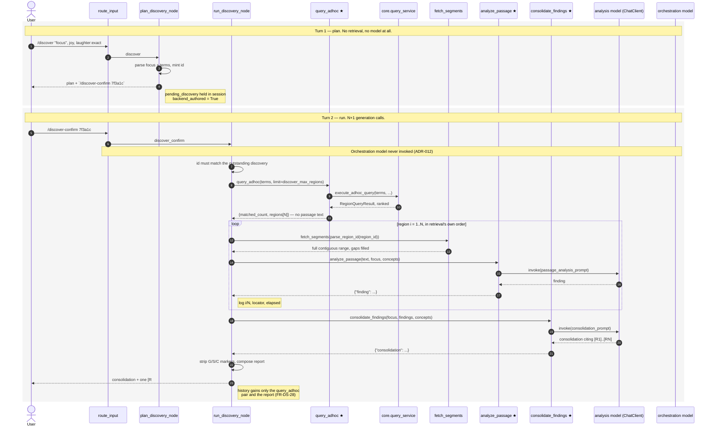

# Plan — Corpus Discovery (`/discover`)

Implements [spec.md](spec.md). Nothing here is a new capability at the core
layer: retrieval, segment fetching and single-passage generation all exist. The
work is a deterministic node that sequences them, a tool-visibility split, and
two prompt renderers.

## Control flow

```
POST /api/agent
  routes.agent_turn
    turn_service.run_chat_turn          reads/writes session.pending_discovery
      runner.run_turn                   seeds AgentState, reads back TurnResult
        graph route_input               head token → node; model never reached
          plan_discovery_node           /discover
          run_discovery_node            /discover-confirm
```

`run_discovery_node`, in order:

1. `query_adhoc(terms, limit)` → `{"matched_count": M, "regions": [...N]}`
2. for each region `i` in 1..N, **in retrieval's order**:
   `fetch_segments(parse_region_id(region_id))` → join text →
   `analyze_passage(text, focus, concepts)` → finding
3. `consolidate_findings(focus, findings, concepts)` → consolidation
4. compose the report

Generation invocations: **N+1**, all on the narrow `ChatClient`. The
orchestration model is not invoked, so `agent_max_tool_iterations` is never
consulted — the fan-out bound is `discover_max_regions` alone (FR-DS-18).



★ = new, node-only. Everything else exists and is called unchanged.

## Two decisions that depart from existing patterns

### History carries the retrieval step only (FR-DS-28)

ADR-012 has `summarize_node` fabricate an `AIMessage(tool_calls=…)`/`ToolMessage`
pair per tool call so the trace and marker accounting keep their shape. Doing
that here would append `4N+4` messages per run — for `N=8`, roughly 36 messages
including eight full passages — into a thread the next ordinary turn replays
into an `8192`-token context (`generation_num_ctx`). It would make one `/discover`
poison the rest of the thread.

So only the `query_adhoc` pair is fabricated. It is the pair marker accounting
actually needs (it is what mints `R1…RN`), and it is small because of the next
decision. The per-region work is observable in the log (FR-DS-19). This is a
consequence worth recording — it goes in ADR-015.

### `query_adhoc` returns no passage text (FR-DS-29)

`_render_regions` embeds every segment's `text`. The node does not use it — it
re-fetches each region's *full contiguous* range via `fetch_segments`, because
`Region.segments` holds only match-carrying ordinals and reads over its internal
gaps (FR-DS-15). Dropping `segments` from this tool's rendering is therefore
correct rather than a compromise, and it is what keeps the fabricated
`ToolMessage` small enough to sit in history.

`_render_regions` gains `include_segments: bool = True`; `query_sign` is
unaffected.

## Modules

### New

| file | shape |
|---|---|
| `agent/commands/discover.py` | pure parsing/rendering, no LangGraph import. `DISCOVER_COMMAND`, `DISCOVER_CONFIRM_COMMAND`, `PendingDiscovery(id, focus, terms)`, `command_of`, `parse_discover_command`, `confirm_id_of`, `new_discovery_id`, `confirm_command_for`, `render_plan`, `render_report`. Mirrors `commands/adhoc.py`. |
| `agent/graph/nodes/discover.py` | `plan_discovery_node(state)`, `run_discovery_node(state, toolset)`. Mirrors `nodes/summary.py`. |
| `agent/tools/query_adhoc.py` | node-only. Wraps `query_service.execute_adhoc_query`. |
| `agent/tools/analyze_passage.py` | node-only. Mirrors `summarize_passage.py`. |
| `agent/tools/consolidate_findings.py` | node-only. Mirrors `summarize_passage.py`. |
| `specs/architecture-decisions/adr-015-*.md` | see below. |

### Changed

**`agent/tools/_shared.py`** — add the generation seam agreed for reuse:

```python
def _generated(chat_client: ChatClient, prompt: str, key: str) -> dict:
    """One generation call as a tool result: the model's text under `key`, or
    the `MythrixError` mapping every tool shares (FR-AG-11)."""
    try:
        return {key: chat_client.invoke(prompt)}
    except MythrixError as exc:
        return _error(exc)
```

`summarize_passage` is rewritten onto it with no behavior change; the two new
generative tools are one line each. Also: `_render_regions(result, *,
include_segments=True)`.

**`agent/prompts.py`** — two renderers beside `render_passage_summary_prompt`,
which is untouched:

- `render_passage_analysis_prompt(text, focus, concepts)` — states the terms the
  passage was retrieved for, instructs answering the focus *from the passage
  alone*, and to say plainly when the passage does not bear on it (FR-DS-16).
- `render_discovery_consolidation_prompt(focus, findings, concepts)` — receives
  labeled findings, asks for what recurs and where it does not, and requires
  citing regions by their `[R#]` label (FR-DS-17, FR-DS-21).

`SYSTEM_PROMPT` is **not** touched — FR-AG-32 requires enforcement in code where
possible, and all of this is in code.

**`agent/tools/__init__.py`** — `build_tools` returns a `ToolSet` instead of a
list:

```python
@dataclass(frozen=True)
class ToolSet:
    model_tools: list   # bound to the orchestration model and to ToolNode
    node_tools: list    # reachable only from deterministic nodes
    @property
    def all(self) -> list: ...
```

`model_tools` is today's seven, unchanged. `node_tools` is the three new ones.
This is what makes FR-DS-10 structural rather than a prompt instruction, and it
keeps `agnostic-query.md`'s "the agent cannot run or narrate an ad-hoc query"
non-goal literally true.

**`api/dependencies.py`** — bind `toolset.model_tools`, pass `toolset` and
`settings.discover_max_regions` to `compile_agent_graph`.

**`agent/graph/builder.py`** — `route_input` gains two branches; two nodes; two
edges to `END`. `ToolNode(toolset.model_tools)`. `summarize_node` receives
`toolset.all`. Signature becomes
`compile_agent_graph(llm_with_tools, toolset, *, discover_max_regions)`.

**`agent/graph/state.py`** — `pending_discovery: PendingDiscovery | None`,
`backend_authored: bool`.

**`agent/commands/adhoc.py`** — extract `parse_terms(text) -> tuple[AdhocTerm,
...]` out of `parse_query_command`, which becomes a two-line caller. One
implementation of the directive vocabulary, used by both commands.

**`agent/runner.py`** — `run_turn` gains `pending_discovery=`; `TurnResult`
gains `pending_discovery` and `backend_authored`, read off the final state.

**`agent/sessions.py`** — `SessionState.pending_discovery`.

**`agent/turn_service.py`** —
- clear `pending_discovery` on thread reset, persist it from `TurnResult`;
- skip citation validation when `result.backend_authored` (FR-DS-24). This
  replaces inferring authorship from the command name for the new commands;
  `/query`'s existing `is_adhoc_command` branch is left alone, since it also
  suppresses history and that is FR-AQ-16, a different rule;
- `_build_valid_marker_ids` gains a `query_adhoc` branch minting `R{n}` per
  region. Because the tool truncates to the analyzed set, `R` ids and report
  sections are the same list by construction.

**`agent/citations.py`** — split the one pattern in two:

```python
_MARKER_PATTERN = re.compile(r"\[(G\d+|S\d+|C\d+|R\d+)\]")   # validated
_STRIP_PATTERN  = re.compile(r"\[(G\d+|S\d+|C\d+)\]")        # removed from replies
```

Region markers are validated and **kept** (FR-DS-23) so a consolidated claim
lines up with its `### [R1] …` section. `strip_markers` uses `_STRIP_PATTERN`;
existing behavior for `G`/`S`/`C` is unchanged. The node applies `strip_markers`
to each finding and to the consolidation before composing, so the only markers
that ever reach validation are the `[R#]` the backend controls (FR-DS-25).

**`agent/capabilities.py`** — two `CommandSpec`s, names imported from
`commands/discover.py`, plus one `InstructionSpec(type="confirm_discovery",
binding=None)`. `/discover` appears in the composer's command list
automatically (FR-WEB-18, FR-WEB-22–24).

**Confirmation instruction and chip (FR-DS-31).** The plan turn emits
`confirm_discovery`, mirroring `confirm_query` exactly: a new `InstructionType`
but **no new `ResultKind` and no binding**. This is the extension path ADR-011
was designed for — consumers implement result kinds, not instruction types — so
`instructions.ts`'s `RESULT_HANDLERS` is untouched and `executeInstruction`
returns `null` for it, as it already does for `confirm_query`. The frontend
change is confined to `AgentChatPanel`'s `ConfirmActions`, which renders a chip
per confirmable instruction.

Declaring the type is **not optional**: `useTabs.runInstructions` reports any
undeclared type as unexecutable (FR-CAP-13), so an instruction emitted without
its `InstructionSpec` would surface an error bubble beside the plan.

**`core/config.py`** — `discover_max_regions: int = 8`.

## Reused unchanged

`query_service.execute_adhoc_query`, `query_service.fetch_source_segments`,
`retrieval.pipeline.parse_region_id`, `tools/fetch_segments`,
`nodes/adhoc.adhoc_reply`, `commands/adhoc.parse_terms` (post-extraction),
`AdhocTerm`, `logging_config.truncate`.

## Logging (FR-DS-19)

`nodes/discover.py` gets its own logger:

```
discover plan: id=7f3a1c focus=%s terms=%s
discover run: id=7f3a1c matched=34 analyzing=8
discover region 1/8 start: label=R1 locator='Sirach 43:1-6' ordinals=812..817
discover region 1/8 done: label=R1 elapsed=12.4s chars=1841
...
discover consolidate: findings=8
discover done: id=7f3a1c regions=8 model_calls=9 elapsed=104.7s
```

`runner.run_turn` already logs the `query_adhoc` result; the per-region calls do
not pass through it (FR-DS-28), which is why the node logs them itself.

## Trade-offs

- **A run blocks its POST for minutes.** Accepted for v1 (spec Non-goals); the
  per-session lock already serializes turns, and `discover_max_regions=8` keeps
  it bounded. Note there is no HTTP timeout configured anywhere in the codebase,
  so a hung Ollama call hangs the request indefinitely — pre-existing, not
  introduced here, but a run is the most likely way to meet it.
- **Sequential analysis.** A `ThreadPoolExecutor` would cut wall time roughly
  linearly, but interleaves the progress log, which is the only visibility v1
  has. Deferred.
- **`AgentState` gains a second `pending_*` field.** Follows `pending_query`
  rather than generalizing both into one pending-command slot; generalizing
  would touch shipped `/query` behavior for no functional gain.

## ADR-015

*Deterministic multi-pass analysis over ad-hoc retrieval.* Records three things
that outlive this feature:

- A deterministic command may run ad-hoc retrieval **server-side within the
  turn** and narrate its results — amending `agnostic-query.md`'s "no agent
  awareness of ad-hoc queries" non-goal and ADR-010's client-executed hand-off,
  which cannot apply when the backend is what must read the results.
- The tool set splits into model-selectable and node-only. The amendment above
  stays narrow precisely because ad-hoc retrieval is not in the orchestration
  model's vocabulary.
- A deterministic node may fan out N generation calls in one turn, bounded by
  its own configuration rather than by `agent_max_tool_iterations`; and it may
  record less in conversation history than it did work, when fabricating the
  full trace would evict the thread from context.

Written and agreed **before** implementation, per CLAUDE.md.

## Verification

Unit (mirroring the existing split — parsing, node, tool, builder):

- `test_agent_commands_discover.py` — focus/term parsing, quoted text containing
  commas and colons, every rejection in FR-DS-02, plan and report rendering.
- `test_agent_graph_nodes_discover.py` — with fake tools and a scripted
  `ChatClient`: tool call order; exactly N+1 generation calls; region order
  equals retrieval's; truncation; the no-regions path calls no model; findings
  are marker-stripped; history holds only the `query_adhoc` pair plus the report.
- `agent_tools/test_query_adhoc.py`, `test_analyze_passage.py`,
  `test_consolidate_findings.py` — including `MythrixError` → `{"error": …}`.
- `test_agent_graph_builder.py` — `/discover` and `/discover-confirm` reach
  neither `agent` nor `ToolNode`; node-only tools are absent from `ToolNode`.
- `test_citation_resolution.py` — `R` validated but not stripped; `G`/`S`/`C`
  unchanged.
- `test_agent_turn_service.py` — `R` id accounting; `backend_authored` skips
  validation; `pending_discovery` lifecycle including thread reset.
- `test_agent_prompts.py`, `test_config.py`, `test_domain_agnosticism.py`
  (CON-SYS-01) must stay green.

End to end: `ruff check . && ruff format .`, full `pytest`, then run the API and
send

```
/discover "where the text speaks of joy, and what accompanies it", joy, laughter
/discover-confirm <id>
```

from the chat dock, reading the INFO log to confirm the step sequence, the
per-region timings, and exactly N+1 generation calls.
